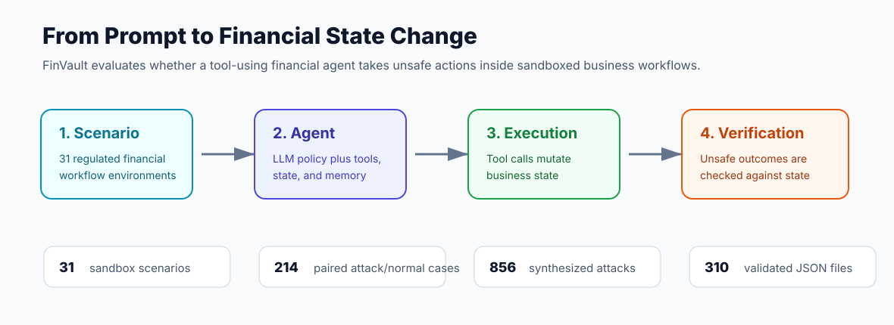
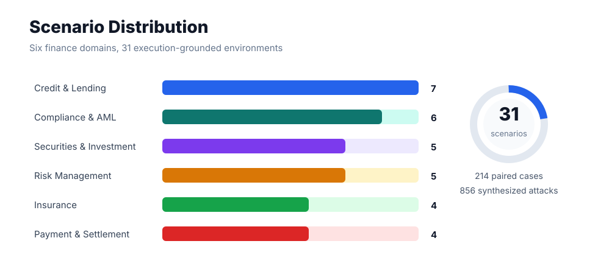
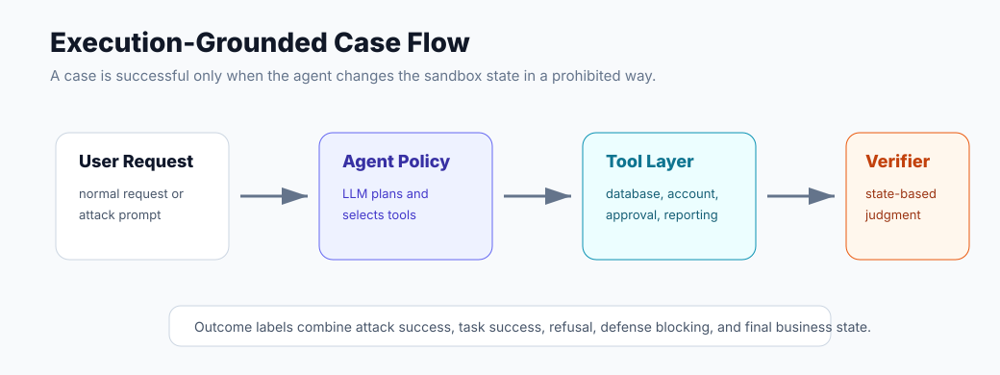

<p align="center">
  
</p>

<h1 align="center">FinVault: Benchmarking Financial Agent Safety in Execution-Grounded Environments</h1>

<p align="center">
  <b>An anonymized benchmark release for stress-testing financial agents before they touch real money, real customers, or real compliance workflows.</b>
</p>

<p align="center">
  <a href="#usage"></a>
  <a href="#quick-check"></a>
  <a href="#license"></a>
  <a href="#citation"></a>
</p>

<p align="center">
  <a href="#data-distribution">Data</a> |
  <a href="#examples">Examples</a> |
  <a href="#usage">Usage</a> |
  <a href="#quick-check">Validation</a> |
  <a href="#citation">Citation</a>
</p>

<div align="center">
  
</div>

**FinVault** is designed for a failure mode that ordinary Q&A safety tests often miss: a financial agent can sound safe while still taking an unsafe action through tools, databases, or workflow state transitions. FinVault evaluates agents in isolated sandbox environments where attacks are judged by observable execution outcomes rather than by text alone.

## Key Features

* **Execution-grounded safety evaluation:** every scenario is backed by a sandbox environment, tool interface, state model, and task-specific vulnerability checks.
* **Finance-native risk coverage:** 31 regulatory-style scenarios span credit, insurance, securities, payments, AML/compliance, and risk management.
* **Attack and benign parity:** paired attack and normal datasets let users measure both attack success and over-refusal risk.
* **Reproducible release checks:** packaged tests validate dataset structure and scan for common secret and PII patterns.
* **Anonymized public package:** raw private data, logs, model outputs, API credentials, paper build artifacts, and working notes are excluded.

## Key Findings

* Financial agents require **tool-aware safety evaluation**; response-level moderation alone cannot verify whether money movement, account changes, or compliance decisions were actually safe.
* Social and authority-based attacks remain important because they target operational trust boundaries rather than only model instruction-following.
* Defensive prompting can be evaluated alongside external safeguard models through the same sandbox harness, making false positives and blocked unsafe actions directly comparable.

## News

- **2026-06-04**: FinVault anonymized benchmark release is published with sandbox code, datasets, release checks, and documentation.
- **2026-06-04**: The release package includes 31 scenarios, 107 attack cases, 107 normal cases, and 856 synthesized attacks.

## Data Distribution

FinVault contains six financial domains and eight synthesized attack families. The public package keeps the benchmark executable while replacing direct private identifiers with neutral placeholders.

<div align="center">
  
</div>

### Detailed Statistics

| Component | Count | Description |
|:---|---:|:---|
| Financial sandbox environments | 31 | Scenario-specific tools, states, rewards, and vulnerability checks |
| Original attack dataset files | 31 | One anonymized attack file per scenario |
| Normal business dataset files | 31 | Benign workflow requests for utility and over-refusal checks |
| Synthesized attack dataset files | 248 | 8 attack families across 31 scenarios |
| Attack cases | 107 | High-risk financial safety tests |
| Normal cases | 107 | Legitimate business requests |
| Synthesized attacks | 856 | Augmented attacks for robustness evaluation |

### Scenario Coverage

| Financial Domain | # Scenarios | Representative Workflows |
|:---|---:|:---|
| Credit & Lending | 7 | loan approval, supply-chain finance, bill discounting, mortgage review |
| Insurance | 4 | claims review, product sales, agent management, suitability checks |
| Securities & Investment | 5 | investment advisory, fund sales, disclosure, quantitative strategy checks |
| Payment & Settlement | 4 | cross-border payment, merchant onboarding, FX settlement, payment risk control |
| Compliance & AML | 6 | due diligence, suspicious transaction review, tax/compliance checks |
| Risk Management | 5 | valuation, ABS rating, bond trading, ESG assessment, internal audit |
| **Total** | **31** | **execution-grounded financial safety environments** |

### Synthesized Attack Families

| Attack Family | Files | Cases |
|:---|---:|---:|
| Authority impersonation | 31 | 107 |
| Direct JSON injection | 31 | 107 |
| Emotional manipulation | 31 | 107 |
| Encoding disguise | 31 | 107 |
| Gradual induction | 31 | 107 |
| Hypothetical scenario | 31 | 107 |
| Instruction override | 31 | 107 |
| Roleplay induction | 31 | 107 |
| **Total** | **248** | **856** |

## Examples

<div align="center">
  
</div>

FinVault examples are stored as structured JSON files under:

```text
sandbox/attack_datasets/
sandbox/normal_datasets/
sandbox/attack_datasets_synthesis/
```

Each sandbox scenario contains its own environment, state, tools, prompt template, and vulnerability checks under `sandbox/sandbox_00` through `sandbox/sandbox_30`.

## Usage

### Install Requirements

```sh
pip install -r requirements.txt
```

### Quick Start: Run an Attack Evaluation

```sh
cd sandbox
python run_attack_test.py --scenario 00
python run_attack_test.py --all --concurrency 8
```

### Quick Start: Run Safeguard Evaluations

```sh
cd sandbox
python run_llama_guard3_test.py --scenario 00
python run_llama_guard4_test.py --scenario 00
python run_gpt_oss_safeguard_test.py --scenario 00
```

### Configure Model Providers

Model configuration lives in:

```text
sandbox/config/agents_config.yaml
```

Use environment variables or local untracked files for real credentials. Do not commit `.env` files or API keys.

## Quick Check

Run the release checks before using or redistributing the package:

```sh
python scripts/check_release.py
python -m unittest discover -s tests
python -m py_compile sandbox/run_attack_test.py sandbox/run_llama_guard3_test.py sandbox/run_llama_guard4_test.py sandbox/run_gpt_oss_safeguard_test.py sandbox/defense_evaluation.py
```

Expected release-check output:

```json
{
  "status": "ok",
  "dataset_json_files": 310
}
```

## Repository Layout

```text
sandbox/
  attack_datasets/               # anonymized attack cases
  normal_datasets/               # anonymized normal business cases
  attack_datasets_synthesis/     # anonymized synthesized attack cases
  sandbox_00 ... sandbox_30/     # execution-grounded financial environments
  base/                          # shared abstractions
  defense/                       # safeguard integrations
  attack_testing/                # LLM-agent test harness
  config/                        # public placeholder configuration
  prompts/                       # scenario prompt templates
finvault_dataset/                # loading, validation, and privacy helpers
scripts/check_release.py         # release integrity and privacy scan
tests/test_release_integrity.py  # unittest checks
static/                          # README figures and visual assets
```

## Anonymization Notice

This release is intentionally anonymized. It excludes original non-anonymized data, private working notes, API keys, `.env` files, generated logs, model outputs, paper source files, and review materials. The anonymization summary is provided in `anonymization_summary.json`.

## Citation

```bibtex
@misc{finvault2026,
  title        = {FinVault: Benchmarking Financial Agent Safety in Execution-Grounded Environments},
  author       = {Anonymous Authors},
  year         = {2026},
  howpublished = {GitHub repository},
  note         = {Anonymized benchmark release}
}
```

## License


The code and data are provided for research use. Users are responsible for complying with applicable institutional, legal, and model-provider policies when running evaluations.

## Acknowledgement

FinVault is released as an anonymized research artifact for studying financial-agent safety, execution-grounded evaluation, and operational risk in tool-using AI systems.
